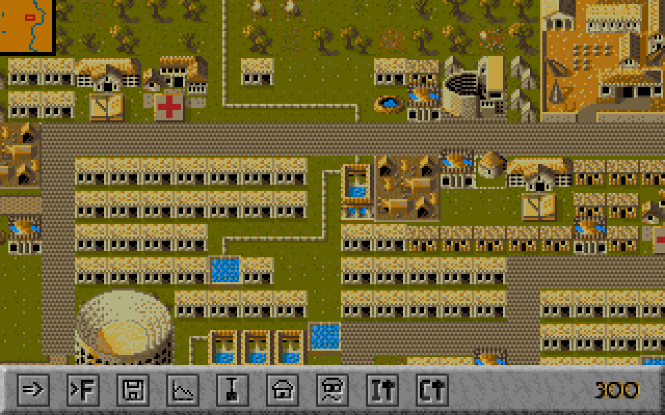
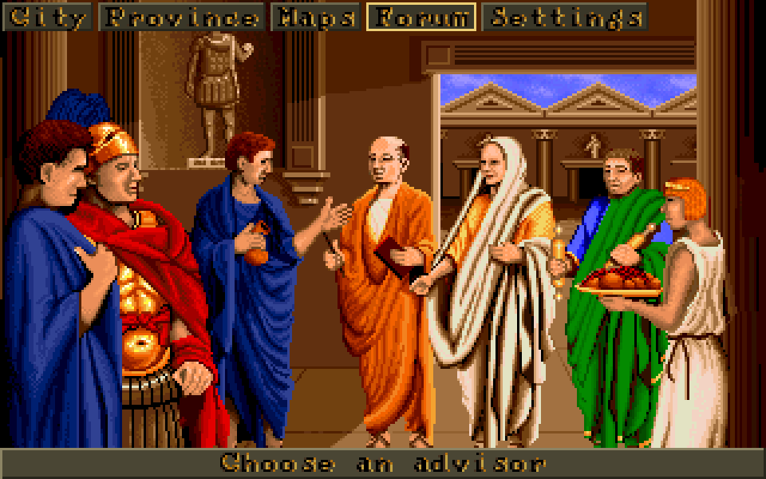
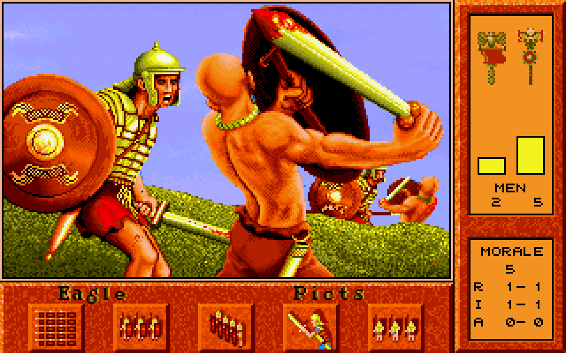
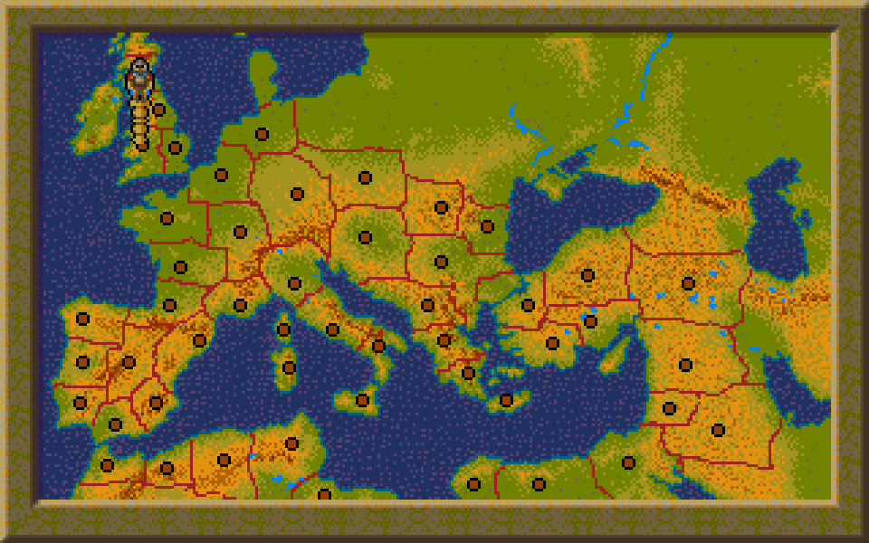
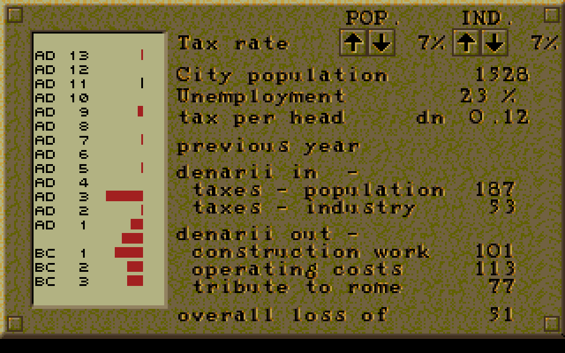

<p align="center">
  
</p>

<p align="center">
  <b>The 1992 city-builder <i>Caesar</i>, rebuilt from the executable up: every rule transcribed, every screen redrawn.<br>
  In your browser, on Windows, Linux, the Steam Deck and Android.</b>
</p>

<p align="center">
  <a href="https://github.com/0x695/Gaius/actions/workflows/build.yml"></a>
  
  
  
  
  
</p>

<p align="center">
  <a href="#what-is-gaius">What is it</a> ·
  <a href="#screenshots">Screenshots</a> ·
  <a href="#download">Download</a> ·
  <a href="#quick-start">Build it</a> ·
  <a href="#controls">Controls</a> ·
  <a href="#how-it-was-built">How it was built</a> ·
  <a href="#contributing">Contributing</a> ·
  <a href="#faq">FAQ</a> ·
  <a href="#documentation">Docs</a>
</p>

<p align="center">
  <br>
  <sub>A city from a real play session, drawn by Gaius from the game's own files. The simulation behind it reproduces the original's saves cell for cell.</sub>
</p>

## What is Gaius?

Gaius is an open-source engine for **Caesar** (Impressions Games, 1992/93, DOS), in the spirit of Julius and Augustus for Caesar III. Point it at your own copy of the game and play a whole career: start as a Citizen, build a province's city, keep the Forum's books, fight off the barbarians, and be promoted until you are Caesar.

It is not an emulator. Gaius **reimplements** the game: the simulation is transcribed from the original executable and checked against real saves, the screens are drawn from your game files the way the original draws them, and the music plays through a transcription of the original's own sound driver. Then it adds what a 2020s port should have: any window size, gamepad and touch, remappable keys, and saving that the original can still read.

> **You need your own copy of Caesar.** Gaius ships none of the game's files. See the [FAQ](#faq) and [IP posture](#ip-posture).

**[Play it in your browser](https://0x695.github.io/Gaius/)**: nothing to install. Open the page, give it your copy of the game (it stays in your browser, never uploaded), press Play. The same engine, built for the web ([how](web/README.md)).

## Highlights

| | |
|---|---|
| **A whole career** | A new game from the start screen; the city, the province with its Cohorts and battles, the Forum and its advisors, the map of the Empire, saving and loading, promotion through the Empire's ranks to Caesar, or dismissal if you stop paying tribute. |
| **Exact where it can be** | A month is the original's 106 steps with its random numbers. One pass of the transcribed rules reproduces the land value and service layers of all 17 real saves on every one of their 10,000 cells; a month of steps reproduces six consecutive saves; the yearly accounts match every save's last year. |
| **The original's look and sound** | Housing, workshops and walkers drawn from your `.PL8` sheets, the control bar, message box, Forum screens and battle screen as the original draws them (several checked pixel for pixel against DOSBox captures), the original opening, and the music and effects through a transcribed AIL driver on an emulated YM3812. |
| **Runs everywhere** | In a browser (WebAssembly, nothing to install), on Windows, Linux, the Steam Deck and Android (arm64 and x86_64), all from one code base, with a resolution-independent UI, gamepad and touch controls, and a paged toolbar that grows with the screen. |
| **Modern comforts** | Fullscreen, borderless or windowed; UI scale 1 to 4; edge, key and middle-drag scrolling; every key and button rebindable; a German translation of Gaius's own texts; your choice of Gaius's gold pointer or the original's arrow; and the original's game pace or a faster one. |
| **Compatible saves** | Reads and writes the original's `.SAV` files; all 17 real saves round-trip byte for byte. Gaius saves to its own folder, never over your DOS game's. |
| **Tools for modders and tinkerers** | Python scripts to export every picture, sprite, sound, tune and map to PNG, WAV and MIDI; list, render, compare and check saves; command-line tools for every file format. |
| **A bot that plays it** | `tools/playtest` plays a career through the real game logic, a regression test with a sense of humour. |

## Screenshots

<table>
  <tr>
    <td width="50%"><br><sub><b>The Forum.</b> Click a figure to open the Treasurer, Tribune, Legion, ratings, histories or the governor's page.</sub></td>
    <td width="50%"><br><sub><b>The battle screen.</b> Four tactics against the province's barbarians, with strength bars and morale.</sub></td>
  </tr>
  <tr>
    <td width="50%"><br><sub><b>The map of the Empire.</b> Fifty provinces to be promoted through.</sub></td>
    <td width="50%"><br><sub><b>The Treasurer.</b> Taxes, costs and the tribute to Rome, year by year.</sub></td>
  </tr>
</table>

<sub>These are captures of Gaius running with the author's own copy of the game, so they show the original's art, whose rights stay with their holders. Make your own with `gaius_viewer --screenshot out.png` (see the quick start).</sub>

## Download

Every release is on the [releases page](https://github.com/0x695/Gaius/releases), with its notes and a `SHA256SUMS` file. You need your own copy of Caesar for all of them.

| Where | Download | Notes |
|---|---|---|
| **Your browser** | [open the page](https://0x695.github.io/Gaius/) | Nothing to install. It asks for your copy of Caesar the first time; the browser keeps it and your saves. |
| **Windows** | `gaius-<version>-windows-x64.exe` (or the `.zip`, which adds the readme and licences) | Run it. One file, nothing to install: even the language files are inside. It is not code-signed yet, so Windows SmartScreen may ask you to confirm. |
| **Linux and Steam Deck** | `gaius-<version>-linux-x86_64.tar.gz` | Needs SDL 2. The Steam Deck notes are inside ([`STEAM_DECK.md`](packaging/linux/STEAM_DECK.md)). |
| **Android** | `gaius-<version>-android.apk` | Allow installs from your browser or file manager, then pick your Caesar folder when it asks. |
| **Your own server** | `gaius-<version>-web.zip` | The browser version as static files ([`web/README.md`](web/README.md)). |

Each build says which version it is: `gaius --version`, the Settings screen's Files tab, and the browser page's footer. What changed between versions: [`CHANGELOG.md`](CHANGELOG.md).

## Quick start

Building from source (the other way to get Gaius):

**1. Get the game.** Buy or find your own legal copy of *Caesar* (the GOG release works). Gaius reads the US build's files, the folder that holds `CSR.EXE`; the GOG release keeps them in a `US` folder.

**2. Build Gaius.** You need CMake 3.16+, a C++17 compiler and SDL2.

```sh
# Linux (Debian/Ubuntu); on the Steam Deck see packaging/linux/STEAM_DECK.md
sudo apt install cmake g++ libsdl2-dev
cmake -S . -B build -DCMAKE_BUILD_TYPE=RelWithDebInfo
cmake --build build -j
./build/gaius_viewer
```

```powershell
# Windows (Visual Studio 2022 Build Tools, SDL2 from vcpkg)
vcpkg install sdl2:x64-windows
cmake -S . -B build -DCMAKE_TOOLCHAIN_FILE="$env:VCPKG_ROOT/scripts/buildsystems/vcpkg.cmake"
cmake --build build --config RelWithDebInfo -j
.\build\RelWithDebInfo\gaius_viewer.exe
```

Android: see [`android/README.md`](android/README.md). The browser build: [`web/README.md`](web/README.md). The CLI tools and format library need no SDL2.

**3. Play.** Run `gaius_viewer`. It looks for your Caesar folder (GOG's and Steam's usual places, then the usual games folders) or asks where it is, and remembers the answer.

```sh
./build/gaius_viewer                      # finds your Caesar folder, or asks where it is
./build/gaius_viewer "/path/to/Caesar"    # the start screen: a new career
./build/gaius_viewer CAESARxx.SAV         # a save (the game's files are looked for beside it, or --assets FOLDER)
./build/gaius_viewer EMPIRE2.0xx          # a province's map
```

Options for one run: `--no-intro` (skips Gaius's title and the original's opening), `--cursor original|gaius`, `--mute`, `--ui-scale N`, `--speed N`, `--save-dir DIR`. The settings (pointer, game pace, window, sound, language) are kept in `gaius.cfg` in the per-user folder (`%APPDATA%\Gaius` on Windows, `~/.config/gaius` on Linux); the game pace is the original's by default, with a faster one as a choice. Saves written by Gaius go to the per-user `saves` folder.

For headless/CI verification (no real display): `SDL_VIDEODRIVER=dummy ./build/gaius_viewer <file> --screenshot out.png --frames 3`, optionally with `--test-pan X Y`, `--test-zoom Z`, `--test-build T X Y`, `--test-hover X Y` or `--screen province|maps|forum`.

## Controls

The right button works as in the original: with a building chosen the map builds; a right click returns to the toolbar, and another takes the last building up again.

| | Mouse and keyboard | Gamepad | Touch |
|---|---|---|---|
| Choose, build | Left click (drag to lay roads and walls) | A | Tap (drag with a road tool) |
| Toolbar / placing; cancel a drag | Right click, Enter | B | Two-finger tap, Undo button |
| Scroll | Arrow keys, WASD, mouse at the edge, middle-drag | Right stick, d-pad | One-finger drag |
| Zoom | Wheel | Triggers | Pinch |
| Next building, its variant | Tab, V | X (LB previous), RB | Toolbar |
| Pause time | Space | Y | — |
| Quick save, quick load | F5, F9 | — (rebindable) | — |
| Change screen | M, the toolbar | View | Toolbar |
| Settings | Esc | Menu | Back |
| Window mode, data layers | F11, F8 | — | — |

The game also saves itself (each year by default, into three rotating autosaves apart from your eight slots) and stops the clock while its window is not in front; both are in Settings > Game, and the Load page's *Autosaves* button lists the quicksave, autosaves and the save made when you last left the window. Every key and button can be rebound in Settings > Keys. Gamepad play on the Steam Deck is described in [`packaging/linux/STEAM_DECK.md`](packaging/linux/STEAM_DECK.md); touch in [`android/README.md`](android/README.md).

## How it was built

Nobody handed over the source. Gaius was built by reading the game: the US build's `CSR.EXE` is unpacked and disassembled, each system is transcribed from the instructions that run it, and every claim is checked against something the real game did: real save files, and DOSBox captures of the running game.

- **Real saves are the test suite.** 17 saves from three play sessions. The service propagators, the housing pass, a whole month, the economy's yearly accounts, the Legion and the plebs each reproduce what the engine saved.
- **Every finding is confidence-labelled** (DEFINITIVE, HIGH CONFIDENCE, STRONG INFERENCE, UNRESOLVED), and the dead ends are kept, because why they failed is the lesson. The write-up is [49 sections](docs/CAESAR_CONSTRUCTION_DISPATCH_FINDINGS.md) long.
- **4,537 checks** run in `gaius_tests` (2,772 without a game folder, which is what CI runs on Linux and Windows).

A few things that turned up on the way:

- The original's pipe command is spelled "Resevoir\pipe" in the executable, and its rank ladder holds "Plebian" and "Taberllarius". Gaius keeps them as found.
- The reservoir command is a *drag* command with its own 528-instruction handler; reservoirs can only be built on water.
- A game year takes about 85 seconds at the original's pace. Gaius first stepped 3.5 times faster, which is why its barbarians seemed too many; the simulation matched, the clock didn't.
- The construction dispatcher only turned up once the search stopped looking for plain offsets: the executable's tables hold far pointers (offset and segment), and a scan for runs of them found it on the sixth pass.
- The Forum's statue has a cheat, opened by typing "c" and then "B".

## Contributing

The cheapest way to help is a **save file**. Play the US build, send a `CAESAR??.SAV`, and `python scripts/check_saves.py` shows whether Gaius's simulation reproduces it cell for cell. Every new save widens the net that caught every wrong parameter in the first version of the service layer.

Phase 11 of the [roadmap](GAIUS_ROADMAP.md#phase-11--play-testing-and-fidelity-to-the-originals-screens) lists what is open: the Tower command, the original's start screen, captures of the province view and the message box to check against, and a water plan so the playtest bot can reach Caesar again. Nothing has run on a physical Android phone or a Steam Deck yet; reports from either are welcome.

House rules: new source files start with an `SPDX-License-Identifier` line; findings carry their confidence label; tests that need game files skip rather than fail when `GAIUS_TEST_ASSETS` is not set; and no original game file goes into this repository, ever.

## FAQ

**Do I need the original game?** Yes. Gaius ships no game files and never will. It needs the files of your own legal copy.

**Which version of the game?** The US build, the one whose `CSR.EXE` Gaius was checked against (GOG's `US` folder). The international build is a different executable and has not been analyzed; if you point Gaius at GOG's top folder it plays from the `US` folder inside it, and if that is missing it tells you so.

**Can I carry on a game I started in the original?** Yes. Gaius reads the original's saves, and what it writes the original can read. It keeps its own saves in its own folder so it never overwrites yours.

**Can I play it in a browser?** Yes: [the web build](https://0x695.github.io/Gaius/) is the same engine compiled to WebAssembly. The first visit asks for your copy of Caesar (a dropped or chosen folder, or a zip of one); the files and your saves stay in the browser's storage on your machine, and *Saves* downloads them. Only Chromium-based browsers have been tried so far.

**Why do fires and collapses keep happening?** In the original they come from the Tribune of the Plebs' page: fire prevention, building and road maintenance need pleb groups in proportion to the city, a new game gives each 10, and the share of the need left uncovered is the chance, every month, of a fire, a collapse or worn roads. Gaius's *Tribune: Automatic* (Settings > Game, on by default) keeps those duties staffed and the plebs coming for you; set it to *By hand* for the original's rule and do it on the Tribune's page yourself.

**Is this Caesar II or Caesar III?** No, only the first game. Caesar III has [Julius](https://github.com/bvschaik/julius) and [Augustus](https://github.com/Keriew/augustus).

**Does it run on the Steam Deck?** It is built for it, with gamepad-only play and fullscreen on first start ([notes](packaging/linux/STEAM_DECK.md)), but nobody has tried it on the real hardware yet. The same goes for a physical Android phone; the emulator, Windows and CI's Linux build are checked.

**Is it finished?** The whole game plays from start to Caesar; what is left is polish and checking more screens against the real game (see the roadmap).

**Why "Gaius"?** A Roman first name, like Julius and Augustus before it.

**Is it affiliated with the makers of Caesar?** No. Gaius is an independent project, and *Caesar*, its art and its names belong to their rights holders.

## IP posture

This repo ships **no original game files**, ever. Every decoder and every test that needs a real Caesar file reads it from a directory you point at via the `GAIUS_TEST_ASSETS` environment variable, or from the game folder Gaius is given: your own legally obtained copy (e.g. from GOG). The screenshots in `docs/images` are captures of the game running and are the only images here that show the original's art. See `GAIUS_MASTERPLAN.md` section 3.

## Documentation

| | |
|---|---|
| [`GAIUS_MASTERPLAN.md`](GAIUS_MASTERPLAN.md) | scope, IP posture and architecture |
| [`GAIUS_ROADMAP.md`](GAIUS_ROADMAP.md) | the phases, what is done and what is open |
| [`docs/FORMATS.md`](docs/FORMATS.md) | every file format, with its status |
| [`docs/CAESAR_CONSTRUCTION_DISPATCH_FINDINGS.md`](docs/CAESAR_CONSTRUCTION_DISPATCH_FINDINGS.md) | the reverse engineering behind every system, 49 sections |
| [`docs/CAESAR_CITY_RENDERER_FINDINGS.md`](docs/CAESAR_CITY_RENDERER_FINDINGS.md) | how the city view is drawn |
| [`docs/CAESAR_EXEPACK_AND_STRINGS_FINDINGS.md`](docs/CAESAR_EXEPACK_AND_STRINGS_FINDINGS.md) | unpacking `CSR.EXE`, and the game's text |
| [`docs/CAESAR_GOG_BUILD_FINDINGS.md`](docs/CAESAR_GOG_BUILD_FINDINGS.md) | what the GOG package holds |
| [`scripts/README.md`](scripts/README.md) | the scripts, in full |
| [`android/README.md`](android/README.md), [`packaging/linux/STEAM_DECK.md`](packaging/linux/STEAM_DECK.md), [`web/README.md`](web/README.md) | Android, the Steam Deck and the browser |
| [`docs/RELEASING.md`](docs/RELEASING.md), [`CHANGELOG.md`](CHANGELOG.md) | how a release is made, and what each one changed |
| [`docs/CODE_SIGNING_POLICY.md`](docs/CODE_SIGNING_POLICY.md) | what is signed, by whom, and what the program does with the network |
| [`THIRD_PARTY_NOTICES.txt`](THIRD_PARTY_NOTICES.txt) | the licences of the components Gaius contains |
| [`docs/TRAILER_PROMPT.md`](docs/TRAILER_PROMPT.md) | a prompt pack for a teaser trailer |

## Reference

### Running the tests

```sh
GAIUS_TEST_ASSETS=/path/to/your/caesar/files ./build/gaius_tests
```

Pure/synthetic tests always run. Corpus tests (round-tripping all 50 `EMPIRE2.0xx` files, the VPX golden-image pixel-diff against a reference render, the PL8 worked-example check, the EXEPACK golden decode) skip cleanly — not fail — if `GAIUS_TEST_ASSETS` isn't set or doesn't contain the relevant files.

### CLI tools

Built alongside the library in `build/`:

```sh
./build/dump_vpx   <in.vpx>  <out.png> [palette.p32|palette.256]
./build/dump_pl8   <in.pl8|in.pl1> <out.png> [palette] [--cols N] [--frames <dir>]
./build/dump_vas   <in.vas> <base.vpx> <palette> <prefix>
./build/dump_voc   <in.voc> <out.wav>
./build/xmi2mid    <in.xmi> <out.mid> [sequence]
./build/render_audio <game dir> <NAME.XMI | effect 0-19> <out.wav> [rate]
./build/render_city <CAESARxx.SAV> <game dir> <out.png> [col row cols rows]
./build/empire_view <EMPIRE2.0xx> --ascii | --summary | --png <out.png>
./build/save_inspect [--summary] <CAESARxx.SAV>
./build/save_diff  <a.SAV> <b.SAV> [--cells N]
./build/sim_check  <CAESARxx.SAV>
./build/month_check <earlier.SAV> <later.SAV>
./build/bindiff_exe <a.exe> <b.exe> [--strings]
./build/playtest   <game dir> play 0 0 3000   # a bot plays a whole career through the real game logic (PT_* knobs in tools/playtest.cpp)
```

### Scripts

`scripts/` has small Python scripts over those tools (Python 3.8+, standard library only), each doing one job on your own copy of the game; `scripts/README.md` describes them.

```sh
python scripts/export_assets.py export/assets --game "/path/to/Caesar"   # every picture, sprite, sound and tune to PNG / WAV / MIDI
python scripts/list_saves.py "/path/to/saves"                            # who governs, when, how rich
python scripts/render_saves.py "/path/to/saves" --out export/cities      # each save's city, drawn with the game's sprites
python scripts/compare_saves.py A.SAV B.SAV [--full]                     # what changed between two saves
python scripts/check_saves.py "/path/to/saves"                           # Gaius's simulation against saves, for contributors
python scripts/test_scripts.py                                           # the scripts' own tests
```

What `export_assets.py` writes is the original game's property: it refuses to write inside this repository except under `export/`, which git ignores.

### Repo layout

```text
formats/    Layer 1 — exact import and write-back (VPX, P32, .256, PL8/PL1, EMPIRE2, SAV, VAS, VOC, XMI, GTL, screen data, EXEPACK)
model/      Layer 2 — normalized data model: CityState/CityMap/Actor, loaded from and serialized to a save
systems/    Layer 3 — the simulation, transcribed from the executable: service (A2C4/C9D4/54A4 propagation and the DS:153A tile dispatch), housing, month (the clock and the random numbers), actors, construction, economy, military, battle, province, plebs, administration, campaign, forum, messages, sounds
render/     the city, the province and the empire map as the original draws them (no SDL)
ui/         the original's screens and toolbar, fonts, settings and translations (no SDL, no apps/)
audio/      the game's sound driver (AIL 2.14, transcribed) and sound layer, no SDL dependency
platform/   window/input/paths abstraction — see GAIUS_MASTERPLAN.md section 5a
apps/       gaius_viewer: the game (a Caesar folder, a save or an EMPIRE2 scenario); with no argument it finds the game or explains where it goes
android/    Android target — see android/README.md
web/        the browser build's page (Emscripten) — see web/README.md
tools/      CLI utilities built on the layers above, and the playtest bot
scripts/    small Python scripts over the tools
tests/      dependency-free test harness (see above)
docs/       FORMATS.md, the findings (the reverse engineering behind each system), IGA_ENTRY.md, TRAILER_PROMPT.md
lang/       Gaius's own texts in other languages (ui/strings.hpp); scripts/extract_strings.py makes the template
packaging/  the Windows and Linux packages, Steam Deck notes and Gaius's icon
VERSION.txt the version, read by CMake, Android, the web page and the release workflow
export/     git-ignored output of scripts/export_assets.py (the original's files, never committed)
third_party/stb/   vendored stb_image / stb_image_write (public domain)
third_party/ymfm/  vendored ymfm, the YM3812 emulator the music plays on (BSD-3-Clause)
```

## Licensing

**Code: [GNU GPL v3.0 or later](LICENSE).** Chosen to match the convention of the
reimplementation community Gaius belongs to (OpenRCT2, OpenRA, OpenMW and OpenXcom
are all GPL-3.0), and so that the reverse-engineering work in this repo stays
available to that community rather than being absorbable into a closed product.

Note the one-way compatibility with the projects named above as inspiration:
Julius and Augustus are both **AGPL-3.0** (verified, not assumed), and AGPL-3.0
permits combining GPL-3.0 work — so they can adopt code from Gaius. The reverse
does not hold, which is deliberate: that's the direction that helps the wider
community. AGPL itself was considered and rejected, since its distinguishing
network-use clause is inert for a local single-player game.

**Documentation: [CC BY-SA 4.0](docs/LICENSE)**, covering `docs/`, `GAIUS_MASTERPLAN.md`
and `GAIUS_ROADMAP.md`. The reverse-engineering findings are arguably this repo's most
valuable output and a code licence fits prose badly; CC BY-SA keeps the share-alike
intent while making the findings cleanly quotable back into the wider preservation
corpus.

**Third-party components** keep their own licences and are not covered by the above:
`third_party/stb/` is public domain, `third_party/ymfm/` is BSD-3-Clause (see its `LICENSE`), and the vendored SDL2 Android glue under
`android/` is zlib-licensed — see [`android/README.md`](android/README.md) for the
attribution detail.

### This is not a licence for the game

The licences above cover **our own code and documentation only**. *Caesar* itself,
its assets, and its trademarks remain the property of their respective rights
holders; nothing here grants any right to them, and this repo distributes none of
them. That's a statement of fact about someone else's intellectual property, kept
deliberately separate from our copyright in our own work — see the IP posture
section above, and `GAIUS_MASTERPLAN.md` section 3.
